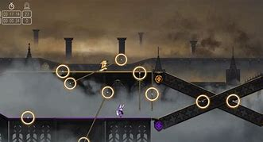

# Brain Anger
# 프로젝트명: brain anger

# [컨셉]

## 메인컨셉 : 분노유발

- 점프킹, 알트에프포 같은 사람들의 게임클리어 욕구를 자극
- 게임이 잘 풀리지않아 화가 날 수 있게 플레이어를 조작해 골인지점까지 도달
- 간단한 조작감을 가졌지만 난이도는 어려운 게임
- 장르 : 액션 생존게임 

### 서브 컨셉 1 :경쟁    
- 라이프카운트 기능을 이용해 얼마나 많이 죽었는지, 타이머를 이용해 얼마나 오래 했는지 확인을 해 다른사람과 경쟁을 부추김
- 생존점수와 시간점수를 계산해 랭킹시스템을 도입

### 서브 컨셉 2 : 맵

- 다른컨셉의 여러 맵을 만들어 다양한 방해요소를 체험해 보며 게임을 즐길 수 있음
- 방해요소들의 기믹을 파훼해 통과할 수 있는 재미를 느낄 수 있음

### 서브 컨셉 3 : 개척

- 3인칭시점에서 1인칭시점으로 시점이 변경되어 미니게임을 진행
- 간단한 미로게임, 날아가는 표적맞추기 등을 이용해 점수 혹은 세이브포인트를 획득

### 서브 컨셉 4 : 개척

-  생각하지 못했던 곳을 방해요소를 이용해 정규루트보다 더빠르게 통과할 수 있게 할 예정

  

# [관련 이미지 & 동영상]

- 이미지  
  
- 동영상
  

  

# [대표 이미지]

  

# [컨셉 & 대표이미지 기반 작품묘사]

> ### 대표이미지 기반 :

> ### 컨셉 기반:

  

# [<게임제목> 구성 요소]

- Brain Anger

 

## 1. 메커니즘

[도전 과제]

1. 얼마나 적게 죽고 빨리 클리어 했나
2. 세이브포인트 획득하기

[재미 요소]

1. 생각지도 못한 장애물과 방해요소를 피해 게임을 클리어하라.
2. 친구들과 서로 경쟁해 더 빠르게 클리어해보자
3. 히든루트를 개척해보자

 

## 2. 이야기

[만들게 된 배경]  
점프킹, alt+f4 같이 간단한 조작감을 가졌지만 화나고 어려웠던 게임을 해보면서, 
내가 기획하고 내가 해도 화가 날 수 있는 못 깰지도 모를 그런 게임을 만들어보고 싶다는 생각이 들어 기획하게 되었다.

[카메라 관점]  
 3인칭 시점에 두 명의 플레이어를 한 사람이 키보드를 이용해 컨트롤해 게임을 진행
 플레이어가 움직일 때 일정거리를 둔 상태로 카메라가 따라감

[세계관]
외딴 섬에 조난당한 두 주인공이 탈출을 위해 섬 이곳저곳을 찾아다니면서 섬을 탈출하기 위해 탐험을 떠난다는 
 

## 3. 미적요소

[디자인][컬러]  
플레이어는 투박한 색으로, 맵 환경은 컨셉에 맞을 만한 색을 골라 구성할 예정

[음향]  
맵 분위기에 맞게 신나는 edm, 락, 클래식 등 여러 분위기에 맞는 효과음을 삽입해 게임을 하는데 있어 지루함을 느끼지 않게한다.
 

## 4. 기술

유니티 엔진과 3d물리엔진을 이용해 플레이어 조작감이 생동감 있게 우스꽝스러운 느낌의 게임을 개발할 것.

# [게임 시스템 ]

# 1. 게임 오브젝트 분해 (구성 요소 분석)

|연번|오브젝트 이름|오브젝트 이미지|
|:----:|:----:|:----:|
|1|플레이어||
|2|장애물||
|3|스테이지||
|4|||

