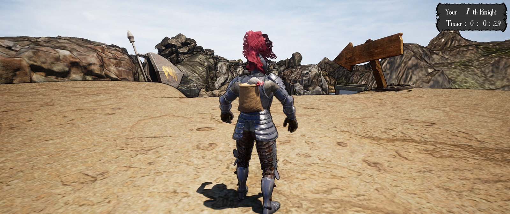
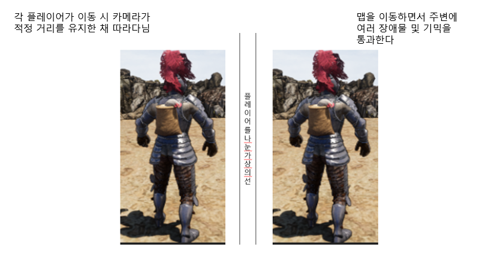
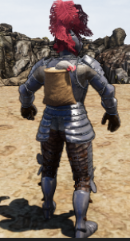
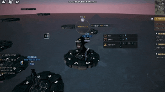
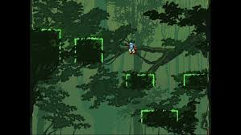
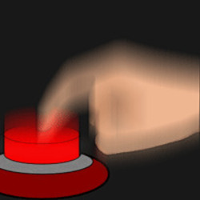
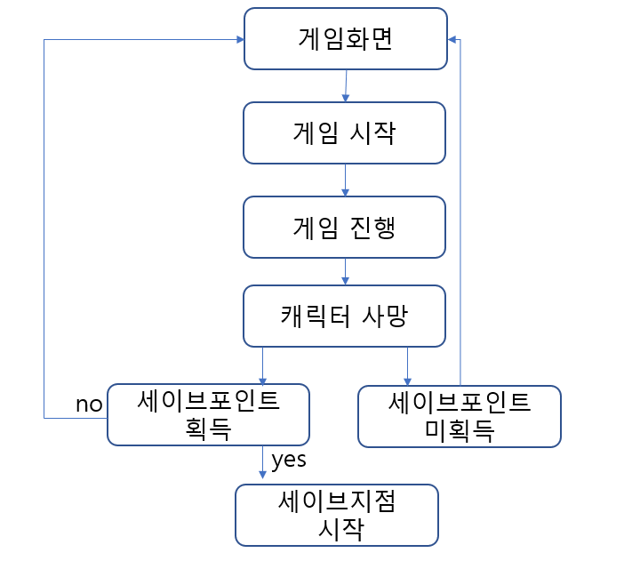
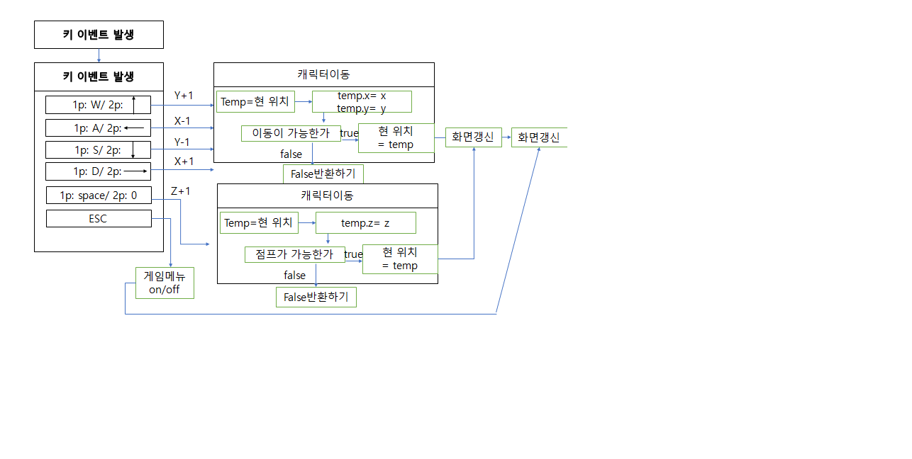

# Brain Anger
# 프로젝트명: brain Anger 

# [ 목차 ]
### 1. [게임명 : Brain Anger](#1)
### 2. [컨셉](#2)
### 3. [관련 이미지와 동영상](#3)
### 4. [대표이미지](#4)
### 5. [컨셉 & 대표이미지 기반 작품묘사](#5)
### 6. [Brain Anger 구성 요소](#6)
### 7. [게임 시스템 디자인](#7)
#### a. [게임 오브젝트 분해](#게임_오브젝트_분해)
#### b. [파라미터(속성)](#파라미터)
#### c. [행동](#행동)
#### d. [상태](#상태)
#### e. [플레이어 캐릭터 속성(파라미터)](#플레이어_캐릭터_속성)
#### f. [게임의 규칙](#게임의_규칙)
### 8. [개발 요구사항 & 흐름도](#8)
#### a2. [요구사항(1년/6주)](#요구사항(1년/6주))
#### b2. [시간별 흐름도](#시간별_흐름도)
#### c2. [키보드 이벤트에 대한 흐름도](#키보드_이벤트에_대한_흐름도)
### 9. [개발작업 일정(6주)](#개발작업_일정(6주))
# [컨셉] 

## 메인컨셉 : 분노유발

- 점프킹, 알트에프포 같은 사람들의 게임클리어 욕구를 자극
- 게임이 잘 풀리지않아 화가 날 수 있게 플레이어를 조작해 골인지점까지 도달
- 간단한 조작감을 가졌지만 난이도는 어려운 게임
- 장르 : 액션 생존게임 

### 서브 컨셉 1 :경쟁    
- 라이프카운트 기능을 이용해 얼마나 많이 죽었는지, 타이머를 이용해 얼마나 오래 했는지 확인을 해 다른사람과 경쟁을 부추김
- 생존점수와 시간점수를 계산해 랭킹시스템을 도입

### 서브 컨셉 2 : 맵

- 다른컨셉의 여러 맵을 만들어 다양한 방해요소를 체험해 보며 게임을 즐길 수 있음
- 방해요소들의 기믹을 파훼해 통과할 수 있는 재미를 느낄 수 있음

### 서브 컨셉 3 : 시점

- 3인칭시점에서 1인칭시점으로 시점이 변경되어 미니게임을 진행
- 간단한 미로게임, 날아가는 표적맞추기 등을 이용해 점수 혹은 세이브포인트를 획득

### 서브 컨셉 4 : 개척

-  생각하지 못했던 곳을 방해요소를 이용해 정규루트보다 더빠르게 통과할 수 있게 할 예정

  

# [관련 이미지 & 동영상] 

- 이미지  
  
- 동영상
  

  

# [대표 이미지] 

  

# [컨셉 & 대표이미지 기반 작품묘사] 

> ### 대표이미지 기반 :   

> ### 컨셉 기반: 
> 분노유발: 맵을 움직이면서 여러 장애물로 인해 죽으면서 자신의 플레이의 화가 날 수 있는 게임을 하는걸 원함.
> 경쟁: 얼마나 많이 죽었는지, 타이머를 이용해 얼마나 오래 했는지 확인을 해 다른사람과 경쟁을 부추김
> 맵 : 다른컨셉의 여러 맵을 만들어 다양한 방해요소를 체험해 보며 게임을 즐길 수 있음
> 시점 : 시점이 변경되어 미니게임을 진행해 간단한 미로게임, 날아가는 표적맞추기 등을 이용해 점수 혹은 세이브포인트를 획득
> 개척 :  생각하지 못했던 곳을 방해요소를 이용해 정규루트보다 더빠르게 통과할 수 있게 할 예정

  

# [<게임제목> 구성 요소] 

- Brain Anger

 

## 1. 메커니즘

[도전 과제]

1. 얼마나 적게 죽고 빨리 클리어 했나
2. 세이브포인트 획득하기

[재미 요소]

1. 생각지도 못한 장애물과 방해요소를 피해 게임을 클리어하라.
2. 친구들과 서로 경쟁해 더 빠르게 클리어해보자
3. 히든루트를 개척해보자

 

## 2. 이야기

[만들게 된 배경]  
점프킹, alt+f4 같이 간단한 조작감을 가졌지만 화나고 어려웠던 게임을 해보면서, 
내가 기획하고 내가 해도 화가 날 수 있는 못 깰지도 모를 그런 게임을 만들어보고 싶다는 생각이 들어 기획하게 되었다.

[카메라 관점]  
 3인칭 시점에 두 명의 플레이어를 한 사람이 키보드를 이용해 컨트롤해 게임을 진행
 플레이어가 움직일 때 일정거리를 둔 상태로 카메라가 따라감

[세계관]
외딴 섬에 조난당한 두 주인공이 탈출을 위해 섬 이곳저곳을 찾아다니면서 섬을 탈출하기 위해 탐험을 떠난다는 
 

## 3. 미적요소

[디자인][컬러]  
플레이어는 투박한 색으로, 맵 환경은 컨셉에 맞을 만한 색을 골라 구성할 예정

[음향]  
맵 분위기에 맞게 신나는 edm, 락, 클래식 등 여러 분위기에 맞는 효과음을 삽입해 게임을 하는데 있어 지루함을 느끼지 않게한다.
 

## 4. 기술

유니티 엔진과 3d물리엔진을 이용해 플레이어 조작감이 생동감 있게 우스꽝스러운 느낌의 게임을 개발할 것.

# [게임 시스템 디자인] 

# a. 게임 오브젝트 분해 (구성 요소 분석) 

|연번|오브젝트 이름|오브젝트 이미지|
|:----:|:----:|:----:|
|1|플레이어||
|2|장애물||
|3|스테이지||
|4|버튼||

# b. 파라미터 
 
 b-1. 플레이어
 
|속성|영문명칭|설명|
|:----:|:----:|:----:|
|이름|name|플레이어를 나눈 이름|
|색상|color|플레이어의 현재 색상|
|점프|jump|플레이어의 점프기능|
|속도|speed|플레이어의 기본이동속도|

b-2. 장애물
 
|속성|영문명칭|설명|
|:----:|:----:|:----:|
|이름|name|장애물별로 가지고 있는 이름 |
|종류|type|장애물들의 타입 예) type_0: 돌 type_1: 발판|
|속도|speed|장애물들이 가지는 속도|

b-3. 스테이지
 
|속성|영문명칭|설명|
|:----:|:----:|:----:|
|이름|s_name|스테이지 별로 가지고 있는 이름|
|종류|s_type |스테이지들이 가지고 있는 컨셉들의 타입 예)s_type_0: 함정 s_type_1: 발판 s_type_2 : 움직이는 발판|

b-4. 버튼
 
|속성|영문명칭|설명|
|:----:|:----:|:----:|
|이름|s_name|버튼의 종류|
|종류|s_type |각 버튼들의 이름|
|상태|stance|버튼의 작동상태여부(active or false)|

# c. 행동 
c-1. 플레이어
 
|행동|설명|
|:----:|:----:|
|이동|방향키로 캐릭터를 움직임|
|점프|점프키를 누름|
|사망|장애물이나 낙하로 인한 사망|
|정지|방향키 조작 중 멈춤|

c-2-1. 돌 장애물

|행동|설명|
|:----:|:----:|
|이동|플레이어를 인식하고 플레이어를 향해 이동|
|재생성|일정 거리가 지나고 다시 지정된 장소에서 재생성|

c-2-2. 발판 장애물

|행동|설명|
|:----:|:----:|
|이동|지정된 조건을 달성 시 지정된 길로 플레이어를 안내|
|재생성|일정 시간이 지나면 다시 원래 장소로 복귀|

c-3. 버튼

|행동|설명|
|:----:|:----:|
|활성화|플레이어가 버튼을 눌러 특정 이벤트발생|
|종료|플레이어가 버튼을 눌러 특정 이벤트발생 혹은 플레이어 사망|

# d. 상태 
d-1. 플레이어
 
|현 상태|전이상태|전이조건|
|:----:|:----:|:----:|
|정상|사망|1.	장애물에 의해 깔림 2.	발판에 튀어나온 가시에 찔림 3.절벽에서 떨어짐|

d-2. 장애물
|현 상태|전이상태|전이조건|
|:----:|:----:|:----:|
|정상|발동|플레이어가 해당 장애물과 접촉|
|발판이 플레이어를 인식하지않음|발판 움직임|조건에 맞는 발판에 플레이어나 오브젝트가 놓여있는 경우|
|정상|재생성|해당 장애물이 일정 거리가 지나 없어질 때 해당 오브젝트를 삭제하고 재생성|
 
 d-2-1. 가시장애물
 
|현 상태|전이상태|전이조건|
|:----:|:----:|:----:|
|정상|발동|플레이어가 해당 장애물과 접촉|
|발동|정상|주변에 플레이어가 없음|

d-3. 버튼

|현 상태|전이상태|전이조건|
|:----:|:----:|:----:|
|비활성화|활성화|1. 플레이어가 버튼을 작동 2.	플레이어가 사망해 게임이 재시작 되는 경우|
|활성화|비활성화|1. 플레이어가 버튼을 작동 2.	플레이어가 사망해 게임이 재시작 되는 경우|

# e. 플레이어 캐릭터 속성(파라미터) 

|속성|영문명칭|설명|
|:----:|:----:|:----:|
|이름|name|플레이어를 나눈 이름|
|색상|color|플레이어의 현재 색상을 나타내는 속성|
|점프|jump|플레이어의 점프기능|
|속도|speed|플레이어의 기본이동속도|

# f. 게임의규칙 
- 위치를 알 수 없는 섬에서 장애물을 피하거나 이용하며 결승점까지 도달하자.
- 플레이어들의 상호작용으로 새로운 루트와 세이브를 이용해보자
- 플레이어가 한명이라도 사망하면 세이브포인트 혹은 스테이지의 처음부터 다시 진행한다
- 플레이어는 지정된 맵 공간 밖으로 벗어날 수 없음
- 세이브포인트는 저장시 한번 밖에 사용하지 못한다.
- 세이브지점은 새로운 세이브포인트가 갱신된다.

# [개발 요구사항 & 흐름도] 
# a2. 요구사항 
### a2-1. 요구사항(6주)
- ~~Enter press any key로 게임을 시작~~
- 게임시작시 간단한 텍스트로 프롤로그를 진행한다. 
- Esc키를 누르면 게임이 잠시 멈추면서 게임종료 할 수 있는 창이 나옴 enter누를시 게임종료가 됨 esc를 한 번 더 누르면 다시 게임화면으로 전환된다.
- ~~가운데 세로로 그어진 선을 기준으로 좌측1p, 우측 2p가 되며 1p는 wasd로 이동을 2p는 방향키를 이용해 움직인다.~~
- 1p점프 스페이스바 2p점프 숫자패드0로 조작이 가능하다.
- 정해진 위치에 발판이나 장애물들이 플레이어를 방해하거나 플레이에 도움을 줄 수 있음.
- 플레이어가 지형지물에 깔리거나 절벽아래로 떨어질 경우 사망 후 세이브포인트 혹은 시작지점으로 회귀함
- 세이브포인트를 사용해 시작지점부터 시작하지않고 세이브한 지점부터 게임을 진행할 수 있다.
### a2-2. 요구사항(1년)
- Enter press any key로 게임을 시작
- 게임시작시 간단한 텍스트로 프롤로그를 진행한다.
- Esc키를 누르면 게임이 잠시 멈추면서 게임종료 할 수 있는 창이 나옴 enter누를시 게임종료가 됨 esc를 한 번 더 누르면 다시 게임화면으로 전환된다.
- 가운데 세로로 그어진 선을 기준으로 좌측1p, 우측 2p가 되며 1p는 wasd로 이동을 2p는 방향키를 이용해 움직인다. 
- 1p점프 스페이스바 2p점프 숫자패드0,  1p 상호작용 g, 2p 상호작용 k로 조작이 가능하다.
- 정해진 위치에 발판이나 장애물들이 플레이어를 방해하거나 플레이에 도움을 줄 수 있음.
- 플레이어가 지형지물에 깔리거나 절벽아래로 떨어질 경우 사망 후 세이브포인트 혹은 시작지점으로 회귀함
- 세이브포인트를 사용해 시작지점부터 시작하지않고 세이브한 지점부터 게임을 진행할 수 있다.
- 스테이지별로 시작지점부터 골인지점까지의 클리어 시간을 카운팅함
- 스테이지 골인지점에 도달할 경우 클리어 시간을 띄워 얼마나 걸렸는지 보여줌
- 장애물을 피하거나 숨겨진 루트를 찾아 클리어 시간을 줄이는게 목표
- 스테이지 중간중간 미니게임이 있을 경우 시점이 변경되고 하나의 플레이어로만 플레이 할 수 있음
- 최종적으로 모든 스테이지를 클리어하면 클리어시간을 종합해 볼 수 있게 됨

# b2.시간별흐름도 
### 시간별 캐릭터 흐름도
 

# c2.시간별흐름도 
### 키보드흐름도
 
 
# [개발작업 일정(6주)] 
 ### 개발작업 일정
  
