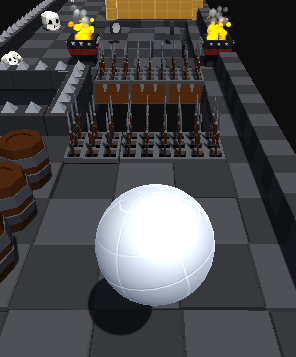
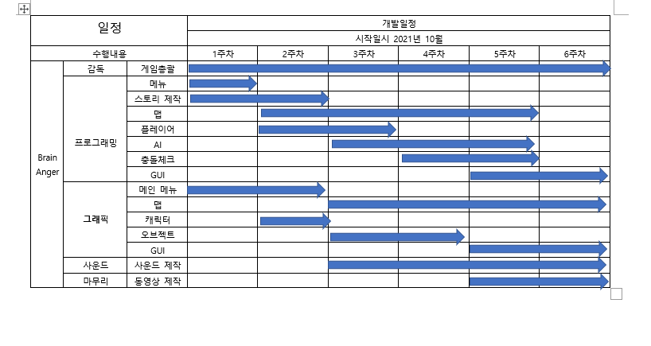

# Brain Anger02  
# 프로젝트명: brain Anger02

# [ 목차 ]
### 1. [게임명 : Brain Anger02](#1)
### 2. [컨셉](#2)
### 3. [관련 이미지와 동영상](#3)
### 4. [대표이미지](#4)
### 5. [컨셉 & 대표이미지 기반 작품묘사](#5)
### 6. [Brain Anger02 구성 요소](#6)
### 7. [게임 시스템 디자인](#7)
#### a. [게임 오브젝트 분해](#게임_오브젝트_분해)
#### b. [파라미터(속성)](#파라미터)
#### c. [행동](#행동)
#### d. [상태](#상태)
#### e. [플레이어 캐릭터 속성(파라미터)](#플레이어_캐릭터_속성)
#### f. [게임의 규칙](#게임의_규칙)
### 8. [개발 요구사항 & 흐름도](#8)
#### a2. [요구사항(1년/6주)](#요구사항(1년/6주))
#### b2. [시간별 흐름도](#시간별_흐름도)
#### c2. [키보드 이벤트에 대한 흐름도](#키보드_이벤트에_대한_흐름도)
### 9. [개발작업일정(6주)](#개발작업일정(6주))
#### a. [개발1주차](#개발1주차)
#### b. [개발2주차](#개발2주차)
#### c. [개발3주차](#개발3주차)
#### d. [개발4주차](#개발4주차)
#### e. [개발5주차](#개발5주차)
#### f. [개발6주차](#개발6주차)

# [컨셉] 

## 메인컨셉 : 분노유발
- 3d 백뷰(back view)
- 원하는대로 게임이 잘 플레이가 되지않아 화가 나지만 플레이어를 조작해 골인지점까지 도달하는게 목표인게임
- 간단한 조작감을 가졌지만 난이도는 어려운 게임을 계획
- 장르 : 아케이드 퍼즐  

### 서브 컨셉 1 : 퍼즐, 아케이드    
- 스테이지를 클리어 하기위해 어떻게하면 좋을지 생각해 볼 수 있게끔 유도
- 클리어시 만족감을 느낄 수 있도록 개발
- 
### 서브 컨셉 2 : 스테이지
- 여러 스테이지를 만들어 다양한 방해요소를 플레이해 게임을 플레이함
- 여러 장애물을 직접 체험해보고 기믹을 파훼해 통과할 수 있는 재미를 느낄 수 있음

### 서브 컨셉 3 : 재시작
- 죽으면 스테이지의 처음부터 다시시작한다. 지금까지 해왔던 걸 처음부터 다시해야 한다 라는 허무함에 분노를 끌어올리는데 한몫 할 수 있을 것 같다. 

### 서브 컨셉 4 : 선택
 - 게임을 클리어 하고 나면 클리어 한 스테이지는 언제나 다시 해볼 수 있다.
 - 선택을 함으로 게임을 플레이 하는데 쉬워질 수도 어려워질 수도 있게 된다.
 
  

# [관련 이미지 & 동영상] 

- 이미지  
  
- 동영상
  []<video width="100%" height="100%" controls="controls">
  <source src="./video/6주차.mp4" type="video/mp4">

  

# [대표 이미지] 

  

# [컨셉 & 대표이미지 기반 작품묘사] 

> ### 대표이미지 기반 :   

> ### 컨셉 기반: 
>분노유발: 원하는대로 게임이 잘 플레이가 되지않아 화가 나지만 플레이어를 조작해 골인지점까지 도달하는게 목표인게임
>퍼즐 and 아케이드: 스테이지를 클리어 하기위해 어떻게하면 좋을지 생각해 볼 수 있게끔 유도하며 클리어했을 때의 만족감을 
>스테이지 :여러 스테이지를 만들어 다양한 방해요소를 플레이해 게임을 플레이함. 어떻게 해야 이걸 클리어할지 고민하는 즐거움
  

# [<게임제목> 구성 요소] 

- Brain Anger02

 

## 1. 메커니즘

[도전 과제]

1. 얼마나 많은 점수를 얻으면서 스테이지를 클리어 하는가
2. 한번도 죽지않고 스테이지를 연속으로 클리어 해보기

[재미 요소]

1. 장애물을 피해 게임을 클리어하라.
2. 점수를 얻으면서 죽지않고 빠르게 클리어해보자

 

## 2. 이야기

[만들게 된 배경]  
간단한 조작감을 가졌지만 내 실수로 인해 화나고 어려웠던 게임을 해보면서, 
내가 기획하고 내가 해도 화가 날 수 있는 못 깰지도 모를 그런 게임을 만들어보고 싶다는 생각이 들어 기획하게 되었다.

[카메라 관점]  
 3인칭 백뷰 시점에  키보드를 이용해 컨트롤해 게임을 진행
 플레이어가 움직일 때 일정거리를 둔 상태로 카메라가 따라감

[세계관]
과제를 밤새 하던 주인공이 정신을 잃고 쓰러져 팔다리없이 뇌만 동동 떠있는 상태로 미지의 공간에 홀로 남겨졌다. 여기저기 발판이 보이니 돌아다니며 탈출구를 찾아 나서보자.
 

## 3. 미적요소

[디자인][컬러]  
플레이어는 단색으로, 맵 환경은 컨셉에 맞을 만한 색을 골라 구성할 예정

[음향]  
맵 분위기에 맞게 신나는 edm, 락, 클래식 등 여러 분위기에 맞는 효과음을 삽입해 게임을 하는데 있어 지루함을 느끼지 않게한다.
 

## 4. 기술

유니티 엔진과 3d물리엔진을 이용해 플레이어 조작감이 생동감 있게 우스꽝스러운 느낌의 게임을 개발할 것.

# [게임 시스템 디자인] 

# a. 게임 오브젝트 분해 (구성 요소 분석) 

|연번|오브젝트 이름|오브젝트 이미지|
|:----:|:----:|:----:|
|1|플레이어||
|2|장애물||
|3|스테이지||
|4|버튼||
|5|점수오브젝트||
|6|도착점||

# b. 파라미터 
 
 b-1. 플레이어
 
|속성|영문명칭|설명|
|:----:|:----:|:----:|
|이름|name|플레이어를 나눈 이름|
|색상|color|플레이어의 현재 색상|
|점프|jump|플레이어의 점프기능|
|속도|speed|플레이어의 기본이동속도|

b-2. 장애물
 
|속성|영문명칭|설명|
|:----:|:----:|:----:|
|이름|name|장애물별로 가지고 있는 이름 |
|종류|type|장애물들의 타입 예) type_0: 돌 type_1: 발판|
|속도|speed|장애물들이 가지는 속도|

b-3. 스테이지
 
|속성|영문명칭|설명|
|:----:|:----:|:----:|
|이름|s_name|스테이지 별로 가지고 있는 이름|
|종류|s_type |스테이지들이 가지고 있는 컨셉들의 타입 예)s_type_0: 함정 s_type_1: 발판 s_type_2 : 움직이는 발판|

b-4. 버튼
 
|속성|영문명칭|설명|
|:----:|:----:|:----:|
|이름|b_name|버튼의 종류|
|종류|b_type |각 버튼들의 이름|
|상태|b_stance|버튼의 작동상태여부(active or false)|

b-5. 점수 오브젝트
 
|속성|영문명칭|설명|
|:----:|:----:|:----:|
|이름|sc_name|점수 오브젝트들의 이름|
|종류|sc_type |점수 오브젝트들의 종류|
|상태|sc_stance|버튼의 작동상태여부(active or false)|

b-6. 도착점
 
|속성|영문명칭|설명|
|:----:|:----:|:----:|
|이름|finish|오브젝트의 이름|
|종류|f_type |오브젝트의 종류|
|상태|f_stance|버튼의 작동상태여부(active or false)|

# c. 행동 
c-1. 플레이어
 
|행동|설명|
|:----:|:----:|
|이동|방향키로 캐릭터를 움직임|
|점프|점프키를 누름|
|사망|장애물이나 낙하로 인한 사망|
|정지|방향키 조작 중 멈춤|

c-2-1. 색깔 장애물

|행동|설명|
|:----:|:----:|
|활성화|발판을 밟을 수 있음|
|비활성화|발판을 밟지 못하게끔 비활성화 됨|

c-2-2. 발판 장애물

|행동|설명|
|:----:|:----:|
|이동|지정된 조건을 달성 시 지정된 길로 플레이어를 안내|
|재생성|일정 시간이 지나면 다시 원래 장소로 복귀|

c-3. 버튼

|행동|설명|
|:----:|:----:|
|활성화|플레이어가 버튼을 눌러 특정 이벤트발생|
|종료|플레이어가 버튼을 눌러 특정 이벤트발생 혹은 플레이어 사망|

c-4. 점수 오브젝트

|행동|설명|
|:----:|:----:|
|활성화|스테이지의 시작|
|비활성화|플레이어와의 접촉|

c-5. 도착점

|행동|설명|
|:----:|:----:|
|활성화|플레이어가 아직 도달하지 못했을 때|
|비활성화|플레이어가 도착점과 충돌 했을|

# d. 상태 
d-1. 플레이어
 
|현 상태|전이상태|전이조건|
|:----:|:----:|:----:|
|정상|사망|1.	장애물에 의해 걸림 2. 발판을 제외한 바닥으로 떨어짐|

d-2. 장애물
|현 상태|전이상태|전이조건|
|:----:|:----:|:----:|
|정상|발동|플레이어가 해당 장애물과 접촉|
|발판이 플레이어를 인식하지않음|발판 움직임|조건에 맞는 발판에 플레이어나 오브젝트가 놓여있는 경우|
|정상|재생성|해당 장애물이 일정 거리가 지나 없어질 때 해당 오브젝트를 삭제하고 재생성|
 
 d-2-1. 가시장애물
 
|현 상태|전이상태|전이조건|
|:----:|:----:|:----:|
|정상|발동|플레이어가 해당 장애물과 접촉|
|발동|정상|주변에 플레이어가 없음|

d-3. 버튼

|현 상태|전이상태|전이조건|
|:----:|:----:|:----:|
|비활성화|활성화|1. 플레이어가 버튼을 작동 2.	플레이어가 사망해 게임이 재시작 되는 경우|
|활성화|비활성화|1. 플레이어가 버튼을 작동 2.	플레이어가 사망해 게임이 재시작 되는 경우|

d-4. 점수 오브젝트

|현 상태|전이상태|전이조건|
|:----:|:----:|:----:|
|활성화|비활성화|플레이어와의 접촉|
|비활성화|활성화|스테이지의 시작|

d-5. 도착점

|현 상태|전이상태|전이조건|
|:----:|:----:|:----:|
|활성화|비활성화|플레이어가 도착점과 충돌 했을 때|
|비활성화|활성화|플레이어가 아직 도달하지 못했을 때|

# e. 플레이어 캐릭터 속성(파라미터) 

|속성|영문명칭|설명|
|:----:|:----:|:----:|
|이름|name|플레이어를 나눈 이름|
|색상|color|플레이어의 현재 색상을 나타내는 속성|
|점프|jump|플레이어의 점프기능|
|속도|speed|플레이어의 기본이동속도|

# f. 게임의규칙 
- 장애물을 피하거나 이용하며 결승점까지 도달하자.
- 플레이어들의 아이템을 먹어가면서 발판과 장애물을 이용해보자
- 플레이어가 스테이지의 처음부터 다시 진행한다
- 플레이어는 지정된 맵 공간 밖으로 벗어날 수 없음
- 게임메뉴를 조작해 스테이지를 고르거나 종료할 수있다.

# [개발 요구사항 & 흐름도] 
# a2. 요구사항 
### a2-1. 요구사항(6주)
- ~~메인메뉴를 구현해 게임을 시작~~
- ~~방향키 혹은 AWSD을 통해 플레이어를 움직이며 스페이스바를 이용해 플레이어가 튕기는 중간에 한번 점프를 할 수 있다.~~
- ~~정해진 위치에 발판이나 장애물들이 플레이어를 방해하거나 플레이에 도움을 줄 수 있음.~~
- ~~플레이어가 발판이나 장애물이 아닌 바닥으로 떨어질 경우 사망하게 된다.~~
- ~~사망한 경우 스테이지의 처음으로 돌아와 다시 게임을 진행한다.~~
- 먹을 수 있는 오브젝트를 구현해 점수를 얻거나 게임진행을 할 수있다.
- ~~점수오브젝트를 다 먹어야 골인 지점에 도달하면 다음스테이지로 진행이 가능하다.~~
- ~~스테이지는 선택을 해 게임을 진행할 수 있다.~~
- ~~플레이어가 기본적으로 통통 튈때나는 소리가 들림.~~
- ~~점수를 획득 할때도 소리가 들림.~~
- Esc키를 누르면 게임이 잠시 멈추면서 게임종료 할 수 있는 창이 나옴 enter누를시 게임종료가 됨 esc를 한 번 더 누르면 다시 게임화면으로 전환된다.

### a2-2. 요구사항(1년)
- 메인메뉴를 구현해 게임을 시작
- 게임시작시 간단한 텍스트로 프롤로그를 진행한다.
- 방향키 혹은 AWSD을 통해 플레이어를 움직이며 스페이스바를 이용해 플레이어가 튕기는 중간에 한번 점프를 할 수 있다.
- 가속되는 플레이어의 속도를 일정하게 유지시킨다.
- 정해진 위치에 발판이나 장애물들이 플레이어를 방해하거나 플레이에 도움을 줄 수 있음.
- 플레이어가 발판이나 장애물이 아닌 바닥으로 떨어질 경우 사망하게 된다.
- 사망한 경우 스테이지의 처음으로 돌아와 다시 게임을 진행한다.
- 먹을 수 있는 오브젝트를 구현해 점수를 얻거나 게임진행을 할 수있다.
- 점수오브젝트를 다 먹지 않아도 골인 지점에 도달하면 다음스테이지로 진행이 가능하다.
- 스테이지는 선택을 해 게임을 진행할 수 있다.
- 직전 스테이지를 클리어해야만 다음스테이지가 언락되어 선택메뉴에서 선택이 가능하다.
- 
- 플레이어가 기본적으로 통통 튈때나는 소리가 들림.
- 점수를 획득 할때도 소리가 들림.
- 최종적으로 모든 스테이지를 클리어하면 엔딩으로 텍스트를 볼 수 있음.
- Esc키를 누르면 게임이 잠시 멈추면서 게임종료 할 수 있는 창이 나옴 enter누를시 게임종료가 됨 esc를 한 번 더 누르면 다시 게임화면으로 전환된다.
# b2.시간별흐름도 
### 시간별 캐릭터 흐름도
 

# c2.시간별흐름도 
### 키보드흐름도
 
 
# [개발작업일정(6주)] 
 ### 개발작업 일정
  
  
# [개발1주차] 
 작업명 : 메인메뉴짜기
 해당 요구사항 :
  1. Enter press any key로 게임을 시작
  2. 게임시작시 간단한 텍스트로 프롤로그를 진행한다.
  3. Esc키를 누르면 게임이 잠시 멈추면서 게임종료 할 수 있는 창이 나옴 enter누를시 게임종료가 됨 esc를 한 번 더 누르면 다시 게임화면으로 전환된다.
작업 내용 : 
 1. 메인게임 화면 만들기(100%)
 2. 텍스트로 enter press anykey 게임화면에 띄우기(100%)
 3. 분할된 상태의 플레이어가 있는 그림의 창을 띄워둠 (게임화면이라 가정)(100%)
 4. esc입력 시 화면 중앙에 메뉴 출력(게임나가기, 게임저장) (100%)
 5. enter를 누를 시 게임저장 () 방향키를 이용해 아랫방향키를 입력하면 게임나가기가 선택됨. (80%)
 6. 게임저장 시 세이브완료라는 텍스트 출력(0%)
 7. 게임나가기 선택 후 enter입력 시 게임종료(0%)

# [개발2주차] 
 작업명 : 게임메뉴 작업 마무리 및 캐릭터 에셋 탐색 및 플레이어 이동 구현 시작 
해당 요구사항 : 
 1. 가운데 세로로 그어진 선을 기준으로 좌측1p, 우측 2p가 되며 1p는 wasd로 이동을 2p는 방향키를 이용해 움직인다.
 2. 1p점프 스페이스바 2p점프 숫자패드0, 1p 상호작용 g, 2p 상호작용 k로 조작이 가능하다. 
작업 내용: 
 1. 시작화면에서 클릭 시 바로 게임메뉴 나오지 않게 작업 (완료)
 2. 최소한의 키입력으로 게임메뉴를 조정 가능하게 작업진행 (70%)
 3. 게임메뉴 추가설정 작업 (30%)
 4. 탐색한 플레이어 에셋을 이용해 플레이어 이동 구현작업 시작 (10%)
 5. 플레이어 카메라 설정 및 분할작업(20%)

# [개발3주차] 
작업명 : 플레이어 이동구현, 맵 제작과 여러 장치(기믹) 구현
해당 요구사항 : 
1. 1p점프 스페이스바 2p점프 숫자패드0로 조작이 가능하다.
2. 정해진 위치에 있는 발판이나 장애물들이 플레이어를 방해하거나 플레이에 도움을 줄 수 있음.
3. 플레이어는 플레이어의 속성에 맞는 색상의 오브젝트만 움직이거나 상호작용이 가능함
작업 내용 : 
1.플레이어 이동구현 마무리
2.맵을 포함한 장치(기믹) 구현

# [개발4주차] 
-특이사항- 개발수정 후 개발 재시작 

해당 요구사항 : 
1) 점수를 획득 할때 소리가 들림
2) 점수 오브젝트를 다 먹어야 골인 지점에 도달하면 다음 스테이지로 진행이 가능하다.
3) 방향키 혹은 AWSD을 통해 플레이어를 움직이며 스페이스바를 이용해 플레이어가 튕기는 중간에 한번 점프를 할 수 있다.
4) 정해진 위치에 발판이나 장애물들이 플레이어를 방해하거나 플레이에 도움을 줄 수 있음.

작업 내용 : 변경된 게임 구체적인 뼈대 만들기

1.변경된 게임의 구체적인 틀 잡기(80%)
2.플레이어의 이동 구현(100%)
3.점수 오브젝트를 먹을 때 소리 구현 및 충돌 후 사라짐 (100%)
4.조건을 만족하고 골인 지점에 도달했을 때 와 하지 못했을 때 문구 구현 (60%)

<video width="100%" height="100%" controls="controls">
  <source src="./video/4주차.mp4" type="video/mp4">
</video>
# [개발5주차] 
해당 요구사항 : 
1. 플레이어가 발판이나 장애물이 아닌 바닥으로 떨어질 경우 사망하게 된다.
2. 사망한 경우 스테이지의 처음으로 돌아와 다시 게임을 진행한다
3. 점수를 먹을 수 있는 오브젝트를 구현해 점수를 얻을 수 있다.
4. 스테이지는 선택을 해 게임을 진행할 수 있다.
5. 플레이어가 기본적으로 통통 튈때나는 소리가 들림.
작업 내용
1. 사망 후 스테이지 재시작 및 사망구현 (80%)
2. 스테이지 클리어 후 씬전환 구현 (60%)
3. 스테이지 여러기믹 구현 (30%)
4. 스테이지 선택 후 게임플레이 구현 (0%)
5. 플레이어 점프 때마다 사운드 삽입작업 (0%)

<video width="100%" height="100%" controls="controls">
  <source src="./video/5주차.mp4" type="video/mp4">
# [개발6주차] 
해당 요구사항 : 
1. 메인메뉴를 만들어 메뉴조작으로 게임을 시작 
2. 게임시작시 간단한 텍스트로 프롤로그를 진행한다
3. 플레이어가 기본적으로 통통 튈때나는 소리가 들림.
4. 스테이지는 선택을 해 게임을 진행할 수 있다.
5. Esc키를 누르면 게임이 잠시 멈추면서 게임종료 할 수 있는 창이 나옴 enter누를시 게임종료가 됨 esc를 한 번 더 누르면 다시 게임화면으로 전환된다.
작업 내용: 
1. 스테이지 선택 후 게임플레이 구현 (100%)
2. 플레이어 점프 때마다 사운드 삽입작업 (100%)
3. 게임메뉴 조작기능(80%)
4. 프롤로그작업(0%)  
5. 스테이지 기믹 구현 (20%)

 <video width="100%" height="100%" controls="controls">
  <source src="./video/6주차.mp4" type="video/mp4">
